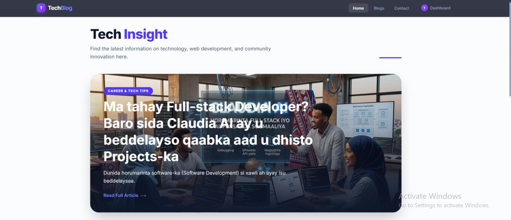
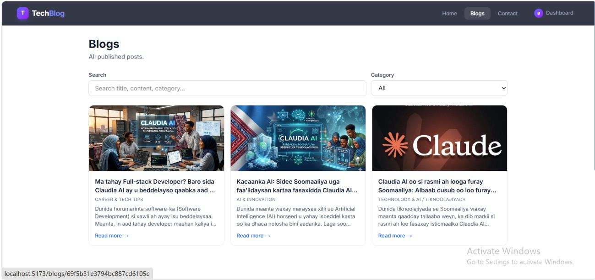
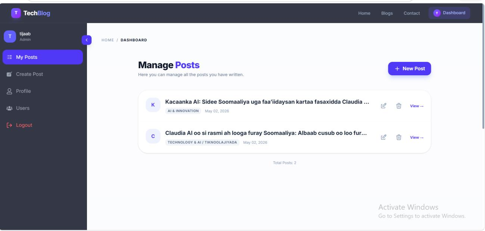
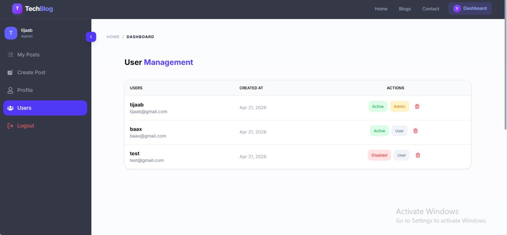
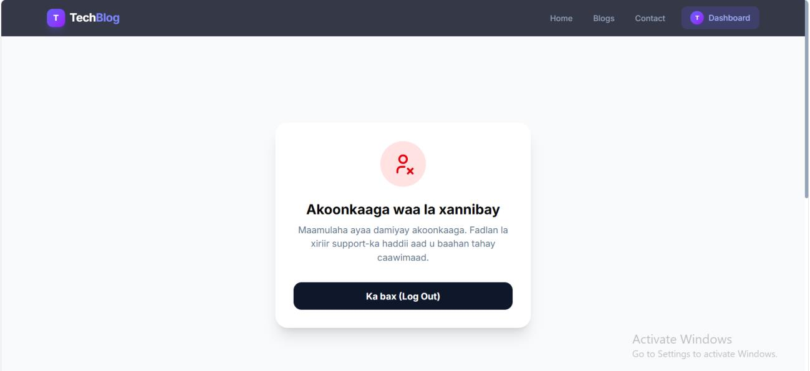

# 🚀 Tech Blog Website

A full-stack tech blog platform where developers, writers, and tech enthusiasts can share knowledge, ideas, and updates on various technology topics. The platform provides a smooth experience for both content creators and readers.

---

## 🌐 Live Demo

- Frontend: https://your-frontend-url  
- Backend: https://your-backend-url  

---

## 📸 Screenshots

### 🏠 Home Page


---

### 📝 Blogs List Page
Displays all published blogs with search and category filtering.



---

### 🧑‍💼 Dashboard
User dashboard for managing posts (Create, Update, Delete).



---

### 🔐 User Management (Admin Panel)
Admin panel for managing users, roles, and account status.



---

### 🚫 Blocked Account View
Displayed when a user account is blocked by the admin.



---

## 🛠️ Tech Stack

### Frontend
- React.js (Vite)
- Tailwind CSS

### Backend
- Node.js
- Express.js

### Database
- MongoDB (Atlas)

---

## ✨ Features

- 🔐 JWT Authentication (Login / Signup)
- 🧑‍💼 Role-based Access (User / Admin)
- 📝 Full CRUD operations for blogs
- 🔍 Search & Filter system
- 📱 Fully responsive UI (Mobile + Desktop)
- 🔒 Secure authorization (users manage only their own posts)
- ⚙️ Admin dashboard for user control

---

## ⚙️ Installation & Setup

### 1️⃣ Clone Repository
```bash
git clone https://github.com/cabdalle8180/TechBlogs-Somalia.git
cd TechBlogs-Somalia